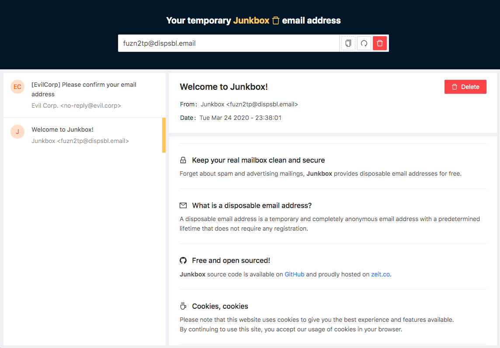

# Junkbox - Disposable email service
Deploy your own disposable email service based on an existing IMAP server.
<p align="center"></p>

### Preview


### Requirements
* An IMAP server (Your own or one created by a provider)
* Aliases with wildcard configuration for a targeted email ([See used ones on Gandi.net](./gandi-aliases.md)).

### Installation
```shell
$ git clone https://github.com/Alexis-Bize/junkbox.git
$ make dev-install
```

### Enviroment variables definition
```bash
# IMAP
IMAP_USER=""                        # IMAP user - Example: hello@domain.com
IMAP_PASSWORD=""                    # IMAP password - Example: ... :)
IMAP_HOST=""                        # IMAP host - Example: mail.domain.com
# Secrets
HASH_KEY=""                         # Secret key to create hashes to prevent unauthorized boxes accesses
# Debug
UNIQUE_BOX="no"                     # [yes/no] Use an unique mailbox
UNIQUE_BOX_VALUE="junkbox-demo"     # Unique mailbox
# Serverless deployment
SERVERLESS="yes"                    # Defined in now.json - Use zeit.co severless routing logic
```

### Build and start
```shell
$ make dev-build
$ make dev-start
```

### Deployment
**[Junkbox](https://junkbox.one)** is hosted on [zeit.co](https://zeit.co/home) which is the perfect fit for deploying static sites and serverless functions. You can deploy your own **Junkbox** with the button below or a single command from your terminal using **[Now CLI](https://zeit.co/download)**.

[](https://zeit.co/import/project?template=https://github.com/Alexis-Bize/junkbox)

Please not that some secrets are required (see `now.json`).
